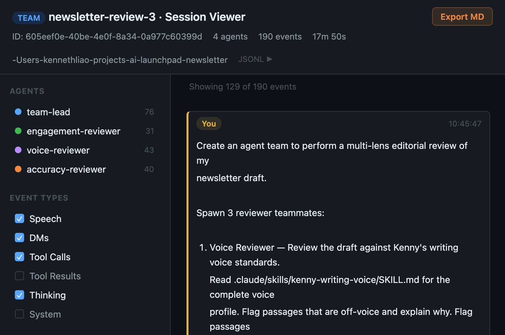

# Agent Teams

Developer tools for Claude Code agent team sessions. View session timelines, analyze team effectiveness, and evaluate against official best practices.

## Prerequisites

- [uv](https://docs.astral.sh/uv/getting-started/installation/) (required for Python scripts)
- Prince Plugins marketplace added — see [main README](../README.md)

### Optional: Installing tmux

tmux is **not required** — agent teams run natively in Claude Code. However, if you want the multi-pane terminal view to watch all agents side-by-side, you'll need tmux installed.

**Mac:**
```bash
brew install tmux
```

**Windows (WSL required):**
```bash
sudo apt update && sudo apt install tmux
```
> tmux is Linux-only. On Windows, install [WSL](https://learn.microsoft.com/en-us/windows/wsl/install) first (`wsl --install`), then install tmux inside WSL.

**Starting a tmux session:**
```bash
tmux new-session -s claude-work
```

## Installation

```
/plugin install agent-teams@ai-launchpad-marketplace
```

When prompted, select **"Install for you (user scope)"** — the first and recommended option.

Restart Claude Code for the changes to take effect.

## Usage

### Step 1: View a session

Ask Claude to view any session by ID or by describing what you were working on:

```
Use the view-team-session skill on the session where we reviewed my newsletter draft
```

This generates a self-contained HTML viewer at `.claude/output/<session-id>.html` and opens it in your browser. For team sessions, it automatically discovers all teammate logs and shows the full inter-agent DM timeline.



### Step 2: Export the session

In the HTML viewer, use the browser's export mechanism to download a markdown transcript of the session. The exported file will save to your Downloads folder.

### Step 3: Move the export

Move the exported markdown file to your project's `.claude/output/` folder:

```bash
mv ~/Downloads/<session-export>.md .claude/output/
```

### Step 4: Analyze the session

Point the analysis skill at the exported file:

```
Use the analyze-team-session skill to analyze .claude/output/<session-export>.md
```

This produces a structured report with a suitability verdict, 10-category scorecard (including task dependencies and quality gates evaluation), actionable recommendations, and an improved prompt rewrite. The report is saved to `.claude/output/<team-name>-analysis.md`.

## Skills

| Skill                  | Description                                                          |
| ---------------------- | -------------------------------------------------------------------- |
| `view-team-session`    | Generate an HTML viewer from Claude Code session JSONL logs          |
| `analyze-team-session` | Analyze a session export against official agent teams best practices |
